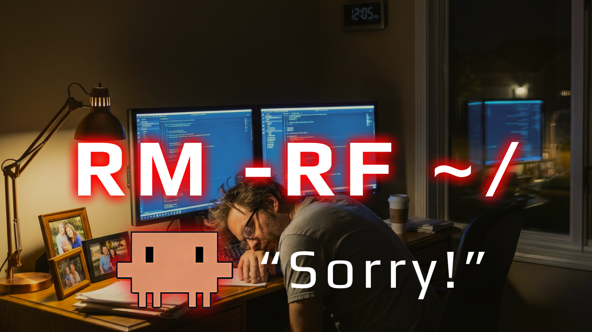

# Claude Code Damage Control



Defense-in-depth protection for Claude Code. Blocks dangerous commands and protects sensitive files via PreToolUse hooks.

---

## How It Works

```
┌─────────────────────────────────────────────────────────────────────┐
│                   Claude Code Tool Call                              │
└─────────────────────────────────────────────────────────────────────┘
                                │
          ┌─────────────────────┼─────────────────────┐
          ▼                     ▼                     ▼
    ┌───────────┐         ┌───────────┐         ┌───────────┐
    │   Bash    │         │   Edit    │         │   Write   │
    │   Tool    │         │   Tool    │         │   Tool    │
    └─────┬─────┘         └─────┬─────┘         └─────┬─────┘
          │                     │                     │
          ▼                     ▼                     ▼
┌─────────────────┐   ┌─────────────────┐   ┌─────────────────┐
│ bash-tool-      │   │ edit-tool-      │   │ write-tool-     │
│ damage-control  │   │ damage-control  │   │ damage-control  │
│                 │   │                 │   │                 │
│ • bashTool-     │   │ • zeroAccess-   │   │ • zeroAccess-   │
│   Patterns      │   │   Paths         │   │   Paths         │
│ • zeroAccess-   │   │ • readOnlyPaths │   │ • readOnlyPaths │
│   Paths         │   │                 │   │                 │
│ • readOnlyPaths │   │                 │   │                 │
│ • noDeletePaths │   │                 │   │                 │
└────────┬────────┘   └────────┬────────┘   └────────┬────────┘
         │                     │                     │
         ▼                     ▼                     ▼
   exit 0 = allow        exit 0 = allow        exit 0 = allow
   exit 2 = BLOCK        exit 2 = BLOCK        exit 2 = BLOCK
   JSON   = ASK
```

---

## Path Protection Levels

All path configurations are in `patterns.yaml`. Each level provides different protection:

| Path Type         | Read | Write | Edit | Delete | Enforced By       |
| ----------------- | ---- | ----- | ---- | ------ | ----------------- |
| `zeroAccessPaths` | ✗    | ✗     | ✗    | ✗      | Bash, Edit, Write |
| `readOnlyPaths`   | ✓    | ✗     | ✗    | ✗      | Bash, Edit, Write |
| `noDeletePaths`   | ✓    | ✓     | ✓    | ✗      | Bash only         |

### zeroAccessPaths
**No access at all** - for secrets and credentials that should never be touched.
```yaml
zeroAccessPaths:
  - ~/.ssh/
  - ~/.aws/
  - ~/.gnupg/
```

### readOnlyPaths
**Read allowed, modifications blocked** - for system files and configs.
```yaml
readOnlyPaths:
  - /etc/
  - ~/.bashrc
  - ~/.zshrc
```

### noDeletePaths
**All operations except delete** - protect important files from accidental removal.
```yaml
noDeletePaths:
  - .claude/hooks/
  - .claude/commands/
```

---

## Damage Control Skill

This project includes a **Claude Code Skill** that provides interactive installation, modification, and guidance workflows. The skill uses `AskUserQuestion` prompts to guide you through each step.

### Skill Triggers

| Say this...                                | And the skill will...                      |
| ------------------------------------------ | ------------------------------------------ |
| "install the damage control system"        | Walk you through installation              |
| "help me modify damage control"            | Guide you through adding paths or patterns |
| "add Windows support to damage control"    | Add PowerShell/cmd patterns for Windows    |
| "how do I manually update damage control?" | Explain the system without automation      |
| "add ~/.secrets to zero access paths"      | Execute directly (you know the system)     |

### Skill Location

The skill is located at `.claude/hooks/damage-control/` and contains:
- **SKILL.md** - Decision tree and cookbook
- **cookbook/** - Interactive workflow guides
- **hooks/** - Python and TypeScript implementations
- **test-prompts/** - Test prompts for validation

---

## Quick Start

### Option 1: Interactive Installation (Skill-Based)

If you have the damage-control skill installed, just say:
```
"install the damage control system"
```

The skill will guide you through:
- Choosing installation level (global, project, or personal)
- Selecting runtime (Python/UV or TypeScript/Bun)
- Handling any existing configuration

### Option 2: Manual Installation

**1. Install UV (Python runtime):**
```bash
curl -LsSf https://astral.sh/uv/install.sh | sh
```

**2. Copy the skill to your project:**
```bash
cp -r .claude/skills /path/to/your/project/.claude/
```

**3. Create hooks directory and copy files:**
```bash
cd /path/to/your/project
mkdir -p .claude/hooks/damage-control
cp .claude/hooks/damage-control/hooks/damage-control-python/*.py .claude/hooks/damage-control/
cp .claude/hooks/damage-control/patterns.yaml .claude/hooks/damage-control/
```

**4. Create settings.local.json:**
```bash
cat > .claude/settings.local.json << 'EOF'
{
  "hooks": {
    "PreToolUse": [
      {
        "matcher": "Bash",
        "hooks": [{
          "type": "command",
          "command": "uv run \"$CLAUDE_PROJECT_DIR\"/.claude/hooks/damage-control/bash_damage_control.py",
          "timeout": 5
        }]
      },
      {
        "matcher": "Edit",
        "hooks": [{
          "type": "command",
          "command": "uv run \"$CLAUDE_PROJECT_DIR\"/.claude/hooks/damage-control/edit_damage_control.py",
          "timeout": 5
        }]
      },
      {
        "matcher": "Write",
        "hooks": [{
          "type": "command",
          "command": "uv run \"$CLAUDE_PROJECT_DIR\"/.claude/hooks/damage-control/write_damage_control.py",
          "timeout": 5
        }]
      }
    ]
  }
}
EOF
```

**5. Restart Claude Code** for hooks to take effect.

**6. Test the installation:**

Prompt Claude Code with a dangerous command - it should be blocked:
```claude
delete all files in /tmp/test recursively
```

**7. (Optional) Run the sentient AI test:**

Copy the test prompt to your project commands:
```bash
mkdir -p .claude/commands
cp .claude/hooks/damage-control/test-prompts/sentient.md .claude/commands/
```

Then run it in Claude Code:
```claude
/sentient
```

This simulates a rogue AI attempting destructive commands - all should be blocked by damage control.

---

## Directory Structure

```
.claude/
├── commands/
│   └── prime.md                       # Agent priming command
│
└── skills/
    └── damage-control/                # Distributable skill
        ├── SKILL.md                   # Skill definition & cookbook
        ├── patterns.yaml              # Security patterns (single source of truth)
        ├── cookbook/
        │   ├── install_damage_control_ag_workflow.md
        │   ├── modify_damage_control_ag_workflow.md
        │   ├── manual_control_damage_control_ag_workflow.md
        │   └── build_for_windows.md
        ├── hooks/
        │   ├── damage-control-python/     # Python/UV implementation
        │   │   ├── *.py
        │   │   └── python-settings.json
        │   └── damage-control-typescript/ # Bun/TS implementation
        │       ├── *.ts
        │       └── typescript-settings.json
        └── test-prompts/              # Test prompts
            ├── README.md              # Read this before running the test prompts
            ├── sentient.md            # Test sentient AI behavior
            ├── sentient_v1.md         # Test rm -rf blocking
            ├── sentient_v2.md         # Test noDeletePaths
            ├── sentient_v3.md         # Test ask patterns (SQL DELETE)
            └── sentient_v4.md         # Test chmod blocking
```

After installation, your project will also have:

### Global Hooks
```
~/.claude/
├── settings.json                      # Hook configuration (created by install)
└── hooks/
    └── damage-control/                # Active hooks (copied by install)
        ├── patterns.yaml
        ├── bash_damage_control.py (or .ts)
        ├── edit_damage_control.py
        └── write_damage_control.py
```

### Project Hooks
```
<current-working-directory>/
└── .claude/
    ├── settings.json                # Hook configuration (created by install)
    ├── settings.local.json          # Personal overrides (gitignored)
    └── hooks/
        └── damage-control/          # Active hooks (copied by install)
            ├── patterns.yaml
            ├── bash_damage_control.py (or .ts)
            ├── edit_damage_control.py
            └── write_damage_control.py
```

### Project Personal Hooks
```
<current-working-directory>/
└── .claude/
    ├── settings.local.json          # Personal overrides (gitignored)
    └── hooks/
        └── damage-control/          # Active hooks (copied by install)
            ├── patterns.yaml
            ├── bash_damage_control.py (or .ts)
            ├── edit_damage_control.py
            └── write_damage_control.py
```

---

## Configuration

### settings.json

```json
{
  "hooks": {
    "PreToolUse": [
      {
        "matcher": "Bash",
        "hooks": [{
          "type": "command",
          "command": "uv run \"$CLAUDE_PROJECT_DIR\"/.claude/hooks/damage-control/bash_damage_control.py",
          "timeout": 5
        }]
      },
      {
        "matcher": "Edit",
        "hooks": [{
          "type": "command",
          "command": "uv run \"$CLAUDE_PROJECT_DIR\"/.claude/hooks/damage-control/edit_damage_control.py",
          "timeout": 5
        }]
      },
      {
        "matcher": "Write",
        "hooks": [{
          "type": "command",
          "command": "uv run \"$CLAUDE_PROJECT_DIR\"/.claude/hooks/damage-control/write_damage_control.py",
          "timeout": 5
        }]
      }
    ]
  }
}
```

### patterns.yaml

```yaml
# Dangerous command patterns (Bash tool only)
bashToolPatterns:
  # Block these entirely
  - pattern: '\brm\s+-[rRf]'
    reason: rm with recursive or force flags

  - pattern: '\bDELETE\s+FROM\s+\w+\s*;'
    reason: DELETE without WHERE clause

  # Ask for confirmation (triggers permission dialog)
  - pattern: '\bDELETE\s+FROM\s+\w+\s+WHERE\b.*\bid\s*='
    reason: SQL DELETE with specific ID
    ask: true

# No access at all - secrets/credentials
zeroAccessPaths:
  - ~/.ssh/
  - ~/.aws/

# Read allowed, modifications blocked
readOnlyPaths:
  - /etc/
  - ~/.bashrc

# All operations except delete
noDeletePaths:
  - .claude/hooks/
```

---

## What Gets Blocked

See [`.claude/hooks/damage-control/patterns.yaml`](.claude/hooks/damage-control/patterns.yaml) for the complete list of blocked commands, protected paths, and security patterns.

### Path Protection Matrix

| Operation       | zeroAccessPaths | readOnlyPaths | noDeletePaths |
| --------------- | --------------- | ------------- | ------------- |
| Read (`cat`)    | ✅ Blocked       | ❌ Allowed     | ❌ Allowed     |
| Write (`>`)     | ✅ Blocked       | ✅ Blocked     | ❌ Allowed     |
| Append (`>>`)   | ✅ Blocked       | ✅ Blocked     | ❌ Allowed     |
| Edit (`sed -i`) | ✅ Blocked       | ✅ Blocked     | ❌ Allowed     |
| Delete (`rm`)   | ✅ Blocked       | ✅ Blocked     | ✅ Blocked     |
| Move (`mv`)     | ✅ Blocked       | ✅ Blocked     | ❌ Allowed     |
| Chmod           | ✅ Blocked       | ✅ Blocked     | ❌ Allowed     |

---

## Ask Patterns

Patterns with `ask: true` trigger a confirmation dialog instead of blocking. This lets users approve risky-but-valid operations.

```yaml
bashToolPatterns:
  # Block entirely (default)
  - pattern: '\bDELETE\s+FROM\s+\w+\s*;'
    reason: DELETE without WHERE clause

  # Ask for confirmation
  - pattern: '\bDELETE\s+FROM\s+\w+\s+WHERE\b.*\bid\s*='
    reason: SQL DELETE with specific ID
    ask: true
```

**Behavior:**
- Pattern without `ask` → Blocked (exit code 2)
- Pattern with `ask: true` → Shows permission dialog (JSON output)

```bash
# Blocked by PreToolUse (no WHERE clause)
DELETE FROM users;

# Triggers confirmation dialog (has WHERE with ID)
DELETE FROM users WHERE id = 1;
```

---

## Testing

### Interactive Tester

Test commands and file paths interactively against your security patterns:

**Python/UV:**
```bash
cd .claude/hooks/damage-control/hooks/damage-control-python
uv run test_damage_control.py -i
```

**Bun/TypeScript:**
```bash
cd .claude/hooks/damage-control/hooks/damage-control-typescript
bun run test-damage-control.ts -i
```

**Example session:**
```
============================================================
  Damage Control Interactive Tester
============================================================
  Test commands and paths against security patterns.
  Type 'quit' or 'q' to exit.
============================================================

Loaded: N bash patterns, N zero-access, N read-only, N no-delete paths

Select tool to test:
  [1] Bash  - Test shell commands
  [2] Edit  - Test file paths for edit operations
  [3] Write - Test file paths for write operations
  [q] Quit

Tool [1/2/3/q]> 1

Command> rm -rf /tmp/test

BLOCKED - 2 pattern(s) matched:
   - rm with recursive or force flags
   - rm with recursive or force flags

Tool [1/2/3/q]> 1

Command> git status

ALLOWED - No dangerous patterns matched

Tool [1/2/3/q]> 2

Path> ~/.ssh/id_rsa

BLOCKED - 1 pattern(s) matched:
   - zero-access path: ~/.ssh/

Tool [1/2/3/q]> q
Goodbye!
```

### CLI Testing

Test individual commands without interactive mode:

```bash
# Test bash hook blocks rm -rf
uv run test_damage_control.py bash Bash "rm -rf /tmp" --expect-blocked

# Test edit hook blocks zero-access path
uv run test_damage_control.py edit Edit "~/.ssh/id_rsa" --expect-blocked

# Test bash allows safe command
uv run test_damage_control.py bash Bash "ls -la" --expect-allowed
```

### Manual Testing

```bash
# Test a hook directly
echo '{"tool_name":"Bash","tool_input":{"command":"rm -rf /"}}' | \
  uv run .claude/hooks/damage-control/bash_damage_control.py
```

### Test Database

A mock SQLite database is provided for testing DELETE protection:

```bash
# Create test database
python apps/mock_db/refresh_db.py

# Test DELETE (should trigger confirmation)
sqlite3 apps/mock_db/test.db "DELETE FROM users WHERE id = 1;"
```

---

## Global vs Project Hooks

| Location                  | Scope          | Use Case               |
| ------------------------- | -------------- | ---------------------- |
| `~/.claude/settings.json` | All projects   | Baseline protection    |
| `.claude/settings.json`   | Single project | Project-specific rules |

**Important**: Global and project hooks run **in parallel**. If either blocks, the command is blocked.

---

## Exit Codes

| Code  | Meaning | Behavior                               |
| ----- | ------- | -------------------------------------- |
| `0`   | Allow   | Command proceeds                       |
| `0`   | Ask     | JSON output triggers permission dialog |
| `2`   | Block   | Command blocked, stderr sent to Claude |
| Other | Error   | Warning shown, command proceeds        |

---

## Troubleshooting

### Hook not firing

1. Check `/hooks` in Claude Code to verify registration
2. Validate JSON: `cat .claude/settings.json | jq .`
3. Check permissions: `chmod +x .claude/hooks/damage-control/*.py`

### Commands still getting through

1. Use interactive tester: `uv run test_damage_control.py -i`
2. Check case sensitivity (patterns use case-insensitive matching)
3. Run with debug: `claude --debug`

### Debug mode

```bash
claude --debug
```

---

## License

MIT

---

## Official Documentation

- [Hooks Reference](https://docs.anthropic.com/en/docs/claude-code/hooks)
- [Settings Configuration](https://docs.anthropic.com/en/docs/claude-code/settings)

---

## Master **Agentic Coding**
> Prepare for the future of software engineering

Learn tactical agentic coding patterns with [Tactical Agentic Coding](https://agenticengineer.com/tactical-agentic-coding?y=dmgctl)

Follow the [IndyDevDan YouTube channel](https://www.youtube.com/@indydevdan) to improve your agentic coding advantage.
